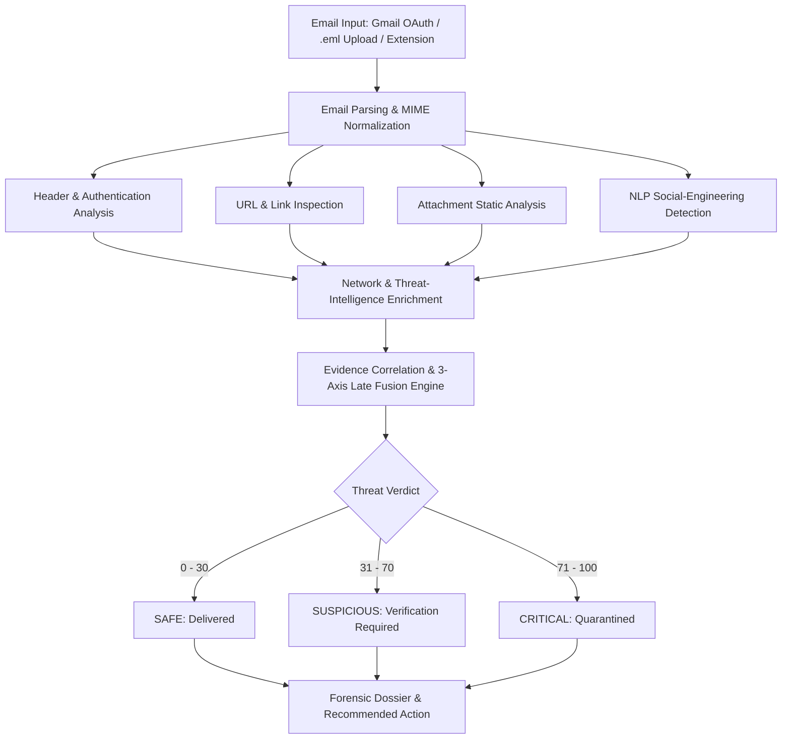

# TRACEGUARD: AI-Powered Email Threat Detection and Forensic Intelligence Platform
## Smart India Hackathon (SIH 2026) — Problem Statement ID: SIH26106
### Theme: Blockchain & Cybersecurity | Team Name: Guardians

---

## Executive Summary

| Attribute | Details |
|---|---|
| **Project Title** | TRACEGUARD: AI-Powered Email Threat Detection & Forensic Intelligence Platform |
| **Team Name** | Guardians |
| **Problem Statement ID** | SIH26106 |
| **Category / Theme** | Blockchain & Cybersecurity |
| **Target End-Users** | Enterprise SOC Analysts, Incident Responders, IT Security Teams, Everyday Email Users |
| **Integration Modes** | 1. Google Workspace / Gmail OAuth 2.0 (`gmail.readonly`)<br>2. Ad-hoc `.eml` / MIME RFC 822 Upload<br>3. Chromium Browser Extension (Manifest V3) |
| **Core Differentiator** | Converts opaque black-box machine learning predictions into **explainable, cryptographically anchored digital forensic evidence** with actionable recommendations. |

---

## 1. Abstract

**TRACEGUARD** is an AI-assisted, evidence-based email threat detection and forensic intelligence platform. It helps users identify phishing emails, spoofed senders, business-email compromise (BEC), delivery fraud, job scams, suspicious URLs, risky attachments, and credential-stealing attempts.

The system connects to Gmail through secure read-only OAuth permission or accepts a separate `.eml` email file for analysis. It extracts message headers, email content, URLs, attachments, sender authentication details, and sender-infrastructure indicators. The collected evidence is correlated to generate a calibrated risk score from **0 to 100** and classify the email into three distinct risk tiers: **Safe**, **Suspicious**, or **Critical**.

Unlike a simple spam warning or opaque binary classifier, TRACEGUARD provides explainable results. It tells the user **why** a message is suspicious and recommends what action to take.

```
┌─────────────────────────────────────────────────────────────────────────────────┐
│                           TRACEGUARD FORENSIC PIPELINE                          │
│                                                                                 │
│  RFC 822 Email Stream (OAuth / .eml)                                            │
│        │                                                                        │
│        ▼                                                                        │
│  [1. SHA-256 Custody Hash] ──► [2. MIME Parser] ──► [3. Auth Protocols]        │
│                                                          (SPF / DKIM / DMARC)   │
│                                                                  │              │
│  [6. GeoIP / Tor / ASN]  ◄── [5. URL & Attachments] ◄── [4. Relay Tracer]       │
│        │                                                                        │
│        ▼                                                                        │
│  [7. NLP Urgency Intent] ──► [8. 3-Axis Fusion] ──► [9. Verdict & Recommendations]│
└─────────────────────────────────────────────────────────────────────────────────┘
```

---

## 2. Problem Statement

Email remains one of the primary attack vectors for phishing, credential theft, bank fraud, business-email compromise (BEC), job scams, fake parcel-delivery messages, malicious attachments, and executive impersonation attacks.

Many users cannot determine whether an email is genuine because critical forensic evidence is hidden inside:
- Complex, multi-hop **email headers**
- **SPF, DKIM, and DMARC** authentication results
- **Reply-To and sender-domain mismatches** (display-name spoofing)
- Deceptive, anchor-mismatched **URLs**
- Sender **IP and routing infrastructure**
- Disguised **attachments and file metadata** (double extensions, macro scripts)
- Coercive **social-engineering language** (financial urgency, panic cues)

Existing email providers may filter obvious spam, but users rarely receive a complete, understandable explanation of the risk. TRACEGUARD addresses this gap by converting technical forensic evidence into a user-friendly verdict and recommended action.

---

## 3. Proposed Solution

TRACEGUARD analyzes emails through two complementary ingestion pathways:

1. **Gmail Integration:**
   The user signs in with Google OAuth and grants `gmail.readonly` access. TRACEGUARD reads emails without sending, deleting, or modifying them.
2. **Separate Email Analysis:**
   The user can upload an `.eml` file or paste raw RFC 822 email content for direct analysis.

The platform performs header analysis, URL inspection, attachment triage, authentication validation, network enrichment, content-pattern detection, and calibrated risk scoring.

### Output Artifacts:
- **Calibrated Risk Score (0–100)**
- **Safe / Suspicious / Critical Classification**
- **Concrete Detection Reasons** (SHAP-style explainability)
- **Sender and Reply-To Identity Comparison**
- **SPF, DKIM, DMARC, and ARC Cryptographic Status**
- **Suspicious URL Warnings & Domain Mismatches**
- **Attachment Indicators** (file entropy, macro detection, PE headers)
- **Sender Infrastructure Context** (Originating IP, ASN, GeoIP, Tor exit-nodes)
- **Recommended User Action** (quarantine, verify independently, safe to interact)
- **Investigation History & Exportable Forensic Report** (PDF and STIX 2.1 JSON)

---

## 4. Objectives

- **Detect** phishing, spoofing, BEC, malware delivery, scams, and impersonation emails.
- **Inspect** suspicious URLs safely without automatically opening them.
- **Verify** sender authenticity through SPF, DKIM, DMARC, and ARC cryptographic alignment.
- **Identify** risky attachment names, extensions, macro/script indicators, and double extensions (e.g. `.pdf.exe`).
- **Enrich** infrastructure context using sender IP, ASN, reverse DNS, Tor exit-node indicators, and GeoIP.
- **Generate** understandable, evidence-backed Safe, Suspicious, and Critical verdicts.
- **Provide** secure, read-only Gmail integration through Google OAuth 2.0.
- **Persist** recent investigation history for forensic review and cross-case correlation.
- **Provide** a lightweight, Chromium-based browser extension (Manifest V3) for Gmail and Outlook.

---

## 5. System Workflow



---

## 6. Functional Modules

### 6.1 Gmail OAuth Module
- Securely connects Google Workspace or personal Gmail accounts via Google OAuth 2.0 PKCE.
- Uses strictly the `gmail.readonly` scope.
- Never requests, views, or stores user passwords.
- Zero email modification: cannot delete, send, or move user messages.
- Supports incremental sync and batch inbox scanning.
- Displays connected mailboxes and active status in the navigation bar.

### 6.2 Separate Email Upload Module
- Allows users to analyze suspicious emails without connecting a Google account.
- Supports `.eml` files, raw RFC 822 MIME byte streams, and pasted header/body content.
- Ideal for analyzing forwarded suspicious messages, exported IT tickets, or air-gapped forensic triage.

### 6.3 Email Parsing Module
- Extracts sender (`From`), `Reply-To`, recipients (`To`, `CC`), `Subject`, `Date`, and `Message-ID`.
- Unfolds multi-line headers and decodes RFC 2047 quoted-printable and base64 strings.
- Separates plain text and HTML MIME parts with clean DOM sanitization.
- Extracts all raw `Received:` header hops in temporal sequence.
- Identifies embedded URLs and extracts attachment payloads with metadata.
- *Technology:* Python `email.parser`, `BeautifulSoup4`, regular expressions.

### 6.4 Header and Authentication Forensics
- **SPF Verification (RFC 7208):** Evaluates `Received-SPF` and sending IP authorization.
- **DKIM Cryptographic Verification (RFC 6376):** Validates digital signatures against DNS public keys.
- **DMARC Policy Enforcement (RFC 7489):** Checks domain alignment between `From:` header and SPF/DKIM domains.
- **ARC Protocol (RFC 8617):** Verifies Authenticated Received Chain for forwarded messages.
- **Anomaly Detection Rules (HDR-01 to HDR-08):**
  - Sender vs. `Reply-To` domain mismatch.
  - Display-name impersonation (VIP executive spoofing).
  - Look-alike / typosquatted domains (Levenshtein distance & Punycode homoglyphs).
  - Timestamp inversion across relay hops.
  - Multiple or synthetic `Message-ID` headers.

### 6.5 URL Intelligence Module
- Safely parses and inspects links without issuing live HTTP requests to untrusted targets.
- Detects HTTP login forms on non-HTTPS origins.
- Flags IP-literal links (e.g. `http://194.26.29.112/login`).
- Expands and identifies known URL shortener domains.
- Detects anchor-text mismatches (e.g. text says `login.microsoft.com` but points to an external server).
- Scans for urgency, OTP, verify, password, and payment keywords in URL path structures.
- Integrates optional threat reputation lookups (VirusTotal, Google Safe Browsing).

### 6.6 Attachment Analysis Module
- Identifies risky file extensions: `.exe`, `.bat`, `.cmd`, `.ps1`, `.js`, `.vbs`, `.scr`, `.jar`, `.iso`, `.lnk`.
- Detects double extensions (e.g. `Overdue_Invoice_8821.pdf.exe`).
- Analyzes Office document macro indicators (`.docm`, `.xlsm`).
- Computes SHA-256 and MD5 cryptographic hashes for threat intelligence lookup.
- Calculates Shannon entropy to detect packed, encrypted, or obfuscated payloads.
- Verifies magic byte signatures against claimed MIME types.

### 6.7 Content and Social-Engineering Detection
- Detects urgent action requests and artificial deadlines ("within 24 hours").
- Identifies account suspension threats and fake security alerts.
- Flags unauthorized bank account or wire transfer directives (BEC).
- Detects delivery fee fraud, fake parcel notifications, and job scam fee requests.
- Employs explainable heuristic rules combined with NLP embeddings to ensure every score has an explicit reason.

### 6.8 Network and GeoIP Intelligence
- Executes reverse SMTP hop traversal (Trust-Frontier algorithm) to identify the true origin server.
- Performs reverse DNS (PTR) and Forward-Confirmed Reverse DNS (FCrDNS) checks.
- Enriches IP addresses with Autonomous System Number (ASN) and organization details.
- Resolves geographic coordinates using MaxMind GeoLite2 City.
- Compares originating IPs against an active list of Tor exit nodes and public proxies.
- *Crucial Disclaimer:* GeoIP reflects server or relay routing infrastructure, not the physical home location of the individual sender.

### 6.9 Threat Scoring and Classification

TRACEGUARD computes an evidence-based risk score from **0 to 100** mapped into three operational tiers:

| Score Range | Classification | Action Required |
|---|---|---|
| **0 – 30** | **SAFE** | Delivered normally. No significant suspicious indicators detected. |
| **31 – 70** | **SUSPICIOUS** | Flagged with warnings. Avoid clicking links or opening attachments until verified. |
| **71 – 100** | **CRITICAL** | Quarantined. High-confidence threat detected. Do not interact. |

---

## 7. Technology Stack

### Frontend & Extension
- **Framework:** React 18, TypeScript, Vite
- **Styling & UI:** Tailwind CSS, Lucide Icons, Framer Motion
- **Visualizations:** Recharts (trend charts), Leaflet / React Leaflet (relay flight maps)
- **Extension Architecture:** Chromium Manifest V3 (Chrome, Edge, Brave) with Shadow DOM injection

### Backend & Ingestion
- **Core Framework:** Python 3.11+, FastAPI, Uvicorn
- **Data Validation:** Pydantic v2
- **Environment:** `python-dotenv`, `python-multipart`

### Forensic & Security Engines
- **MIME & Headers:** Standard Python `email` library, `BeautifulSoup4`, regex
- **Cryptographic Auth:** `dkimpy`, `dnspython` (SPF, DKIM, DMARC, ARC)
- **Evidence Integrity:** SHA-256 cryptographic hashing, NIST SP 800-86 custody ledger
- **Reporting:** ReportLab (automated PDF generation), STIX 2.1 JSON exporter

### Network Intelligence
- **GeoLocation:** MaxMind GeoLite2 City (`geoip2`)
- **Network Routing:** Team Cymru ASN lookup, FCrDNS PTR resolution
- **Threat Feeds:** Local Tor exit-node cache, optional VirusTotal / AbuseIPDB integrations

---

## 8. Security and Privacy

- **Read-Only Authorization:** Gmail integration requests strictly `gmail.readonly`. The application cannot send, delete, move, or modify emails.
- **Zero Password Storage:** Passwords are never collected or stored; authentication relies on OAuth 2.0 token exchange.
- **Credential Protection:** Secrets and tokens reside in backend `.env` variables excluded from Git tracking.
- **Evidence Immutability:** Stored `.eml` raw payloads are anchored with SHA-256 hashes to guarantee data integrity during forensic investigations.
- **Local-First Architecture:** Core threat detection, heuristic analysis, and GeoIP lookups execute entirely on-premise without transmitting email contents to unverified third-party cloud services.

---

## 9. Database and Investigation History

The platform maintains an investigation repository containing:
- Unique Investigation ID and Gmail Message ID
- Normalized Subject, Sender, Recipient, and Timestamp
- Calibrated Threat Score and Classification
- Complete 3-Axis Intelligence Breakdown
- Key Signals and Actionable Explanations
- Protocol Authentication Matrix (SPF/DKIM/DMARC/ARC)
- Immutable SHA-256 Raw MIME Evidence Anchor

The working prototype uses a lightweight SQLite database (`traceguard.db`), designed for seamless migration to PostgreSQL in enterprise multi-tenant deployments.

---

## 10. Scalability Plan

```
[Inbound Email Feed] ──► [Redis / Celery Queue] ──► [Distributed Worker Pool]
                                                            │
    ┌───────────────────────────────────────────────────────┴────────────────────────┐
    ▼                                                       ▼                        ▼
[Auth Verification]                                   [Static ML Triage]       [Threat Intel Cache]
    │                                                       │                        │
    └───────────────────────────────────┬───────────────────┴────────────────────────┘
                                        ▼
                           [PostgreSQL / S3 Custody]
                                        ▼
                      [Web Dashboard & Chrome Extension]
```

### Key Scaling Strategies:
- **Asynchronous DAG Architecture:** Forensic engines execute concurrently via asynchronous worker tasks.
- **Threat Intelligence Caching:** DNS, ASN, and reputation lookups are cached locally to minimize latency and respect external rate limits.
- **Deduplication:** Raw payload SHA-256 hashes prevent redundant analysis of previously inspected messages.
- **Horizontal Worker Scaling:** Stateless inspection workers can be dynamically autoscaled under high inbound volume.

---

## 11. Limitations & Mitigations

| Challenge / Limitation | Technical Mitigation in TRACEGUARD |
|---|---|
| **Compromised Legitimate Account** (passes SPF/DKIM) | Content NLP classifier flags urgency, payment redirections, and anomalous banking instructions regardless of valid cryptographic keys. |
| **New Zero-Day Phishing Campaigns** (no reputation reports yet) | Heuristic rules catch typosquatted look-alike domains, anchor mismatches, and newly registered domain ages. |
| **Third-Party API Rate Limits** | Offline-first architecture using local MaxMind GeoIP and local Tor exit lists ensures 100% functionality without internet lookups. |
| **GeoIP Imprecision** | Clear visual disclaimers indicate that GeoIP represents intermediate relay server infrastructure, not the attacker's physical home. |

---

## 12. Future Scope

- **Official Gmail Workspace Add-On:** Native Google Workspace marketplace integration.
- **Real-Time Push Ingestion:** Integration with Gmail Push Notifications via Google Cloud Pub/Sub.
- **Automated Sandbox Detonation:** Automated safe detonation of suspicious attachment executables in an isolated microVM.
- **YARA Rule Engine:** User-definable YARA rules for custom enterprise attachment pattern matching.
- **Enterprise SIEM/SOAR Integration:** Direct alert streaming into Splunk, Microsoft Sentinel, and Elastic Security via STIX 2.1.
- **Automated Remediation Actions:** 1-click enterprise quarantine, domain blocklisting, and domain-wide message retraction.

---

## 13. Conclusion

**TRACEGUARD** provides a user-friendly, explainable, and scientifically rigorous approach to email threat detection. By uniting Gmail read-only OAuth integration, ad-hoc `.eml` file inspection, deep cryptographic header forensics, URL safety checks, attachment static analysis, network intelligence, and calibrated threat scoring, the platform empowers users to make safe, informed decisions before clicking fraudulent links or falling victim to financial deception.

It is delivered as a fully functioning prototype featuring an interactive SOC Web Console, a FastAPI gateway, and a companion Manifest V3 browser extension ready for enterprise deployment.
